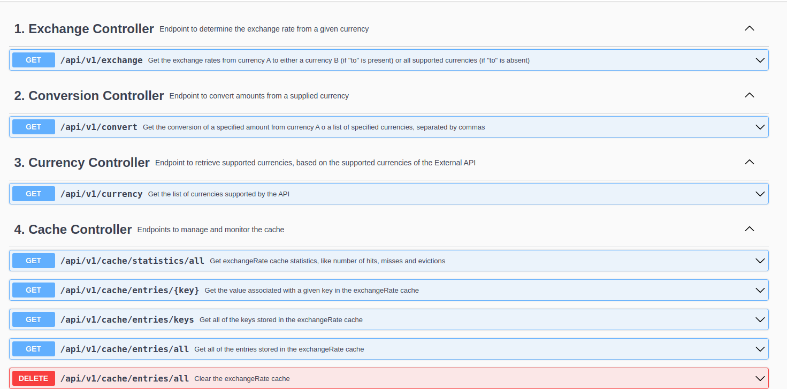
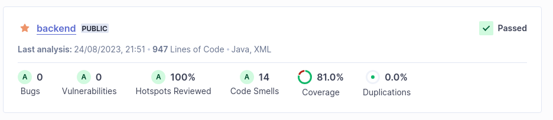

# Exchange Rate API

The Exchange Rate API is an API developed using the Spring Boot framework in Java, with the aim of allowing users to fetch exchange rates between a vast set of supported currencies, as well as allowing them to do value conversions between these currencies, using said exchange rates. The exchange rate data is fetched from a publicly available API, [exchangerate.host](https://exchangerate.host/#/), which sources the rates from the European Comission's databases. 

This project was developed using the feature-branch workflow, and various QA techniques to ensure the service met the specified requirements, such as the development of a CI pipeline, static code analysis and a TDD approach.
Various methods were also integrated to ease the required calls made to the external provider, such as the implementation of a cache.

## Table of Contents
1. [Implementation Strategies](#implementation-strategies)
2. [Development and Quality Assurance Practices](#development-and-quality-assurance-practices)
3. [How to Run](#how-to-run)
5. [Screenshots](#screenshots)

## Implementation Strategies

The API developed on this project supports the following main operations:

- A: Get exchange rate from Currency A to Currency B
- B: Get all exchange rates from Currency A
- C: Get value conversion from Currency A to Currency B
- D: Get value conversion from Currency A to a list of supplied currencies

The project was implemented using a layered architecture, with Controllers handling the HTTP requests, Services that contain the business logic and processes of the application, and Repositories and Models managing the data storage, retrieval and manipulation.

In order to comply with the implementation of these operations, as well as with the requirement for minimizing calls to the external API, the following implementation decisions were made:

- The fetching of data from the External API is handled using WebClient. Calls to the External API are handled in an adapter, the ExternalAPIService, and the data from the response is parsed using Jackson and it's corresponding DTO models.
- The External API has a list of supported symbols, which can be fetched from a specific endpoint. In the implemented API, a call is made at application startup using CommandLineRunner to retrieve these symbols, which are then stored in an in-memory database using H2. The data model layer includes a Currency entity that is used to represent the supported currencies. The call to this endpoint is implemented in a scheduled job, so that any changes to the list of supported symbols by the External API are also reflected in the implemented API.
- In order to reduce the number of calls made to the External API, two decisions were made:
    - The external API is only contacted for retrieval of exchange rates. That means that, in the operations in which conversion of currencies is made, the currency conversion is calculated on the implemented API, using the rates retrieved from the external API, instead of contacting the external API's conversion endpoints.
    - A cache was implemented using Spring Boot's cache abstraction, and Caffeine as the implementation. In this cache, the exchange rates of the External API are stored with a TTL of 1 minute. Each individual exchange rate from currency A to a currency B is stored has an individual entry in this cache. Thus, when any operations are made, the exchange rates are first retrieved from the cache, with the External API being contacted only when the rate is not stored.
- Custom exception handling was implemented for potential exceptions generated during the supported operations, such as errors contacting the external API, errors handling the cache, invalid parameters sent by users, among others. These were handled with a custom Exception Handler.
- Operations A and B were implemented in the same endpoint of the ExchangeController, while operations C and D were implemented on the same endpoint of the ConversionController.
- Besides these 2, a CurrencyController was implemented, with an endpoint to retrieve the currencis currently supported by the application; a CacheController was also implemented, with endpoints used mostly during the development for debugging purposes.

## Development and Quality Assurance Practices

During the development of the application, some coding and development practices were applied to ensure good coding standards:

- The management of the repository and version control was done following the git feature-branch workflow. 
- A continuous integration (CI) pipeline was implemented, which included automated building and testing, followed by static code analysis using SonarCloud, with Jacoco being used to evaluate test coverage. This static code analysis was implemented on each push and merge into the main branch of the repository, with quality gates evaluating not only test coverage, but also the creation of bugs, security hotspots, vulnerabilities and code smells.
- The test-driven development (TDD) practice was followed, with the writing of tests preceding the writing of actual code. The development of the project included:
    - Unit tests to test the logic of implemented services, using JUnit and the Mockito library for mocking.
    - Boundary tests to test the REST controllers behavior, using the @WebMvcTest mode and Mock Mvc.
    - Integration tests, in which the entire REST application context is loaded, using RestAssured.
- Logging was also made to track the application flow and monitor its behavior. For this, the SL4J library was used.


## How to Run

### Docker 

The REST service is deployed using Docker Compose. Thus to run, after having [installed Docker](https://docs.docker.com/engine/install/), the user only needs to run the following command on the main folder of the project:

```bash
$ docker-compose up
```

### Local

If the user wishes to run the Spring Boot project instead, after having installed Java's [JDK 17](https://www.oracle.com/java/technologies/javase/jdk17-archive-downloads.html) and [Maven](https://maven.apache.org/), the user needs to move to the backend folder, and run the project from there:

```bash
$ cd ./backend
$ mvn spring-boot:run
```
### Links

After the user has run the project, using either method, the REST API and the Swagger UI documentation are available in the following links:

- REST API at [http://localhost:8080/api/v1/](http://localhost:8080/api/v1)
- Swagger UI documentation at [http://localhost:8080/api/v1/swagger-ui.html](http://localhost:8080/api/v1/swagger-ui.html)

Swagger UI can be used to test all the developed endpoints.

## Screenshots

- Swagger UI documentation page
  

- Sonar Cloud code analysis for the project
  


